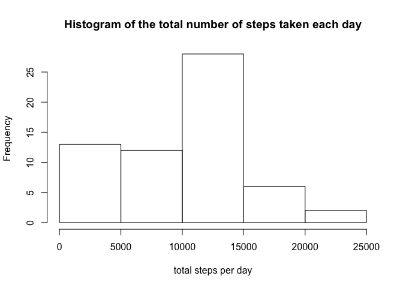
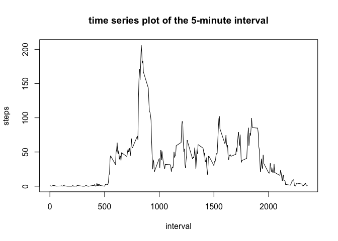
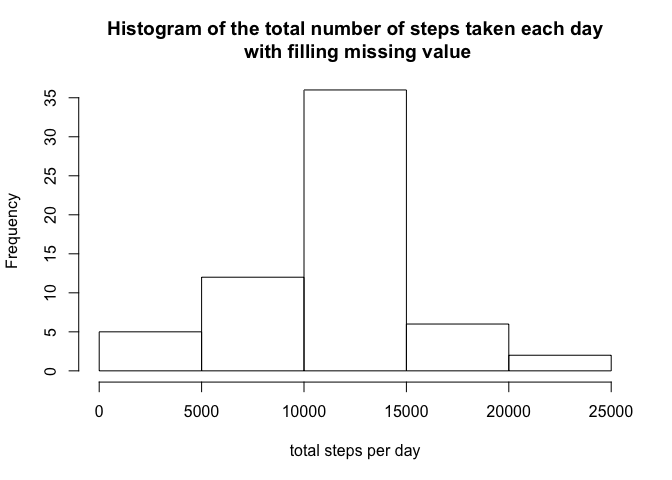
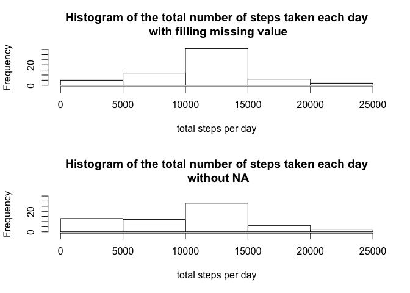
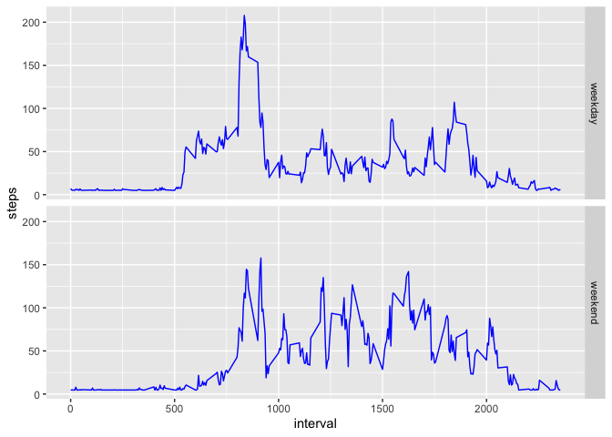

Loading and preprocessing the data
----------------------------------

1.  Load the data

<!-- -->

    dt <- read.csv("activity.csv", sep=",", header=TRUE, na.strings="NA")
    head(dt)

    ##   steps       date interval
    ## 1    NA 2012-10-01        0
    ## 2    NA 2012-10-01        5
    ## 3    NA 2012-10-01       10
    ## 4    NA 2012-10-01       15
    ## 5    NA 2012-10-01       20
    ## 6    NA 2012-10-01       25

1.  date column : YYYY-MM-DD format

<!-- -->

    dt$date <- as.Date(dt$date, "%Y-%m-%d")

    ## Warning in strptime(x, format, tz = "GMT"): unknown timezone 'zone/tz/2020a.1.0/
    ## zoneinfo/America/Los_Angeles'

What is mean total number of steps taken per day?
-------------------------------------------------

1.  Make a histogram of the total number of steps taken each day

<!-- -->

    dt_tstep <- tapply(dt$steps,dt$date,sum, na.rm=TRUE)
    hist(dt_tstep, xlab="total steps per day", main="Histogram of the total number of steps taken each day")

1.  Calculate and report the mean and median total number of steps taken
    per day

-   mean total number steps taken per day

<!-- -->

    dt_mean <- mean(dt_tstep, na.rm=TRUE)
    dt_mean

    ## [1] 9354.23

-   median total number steps taken per day

<!-- -->

    dt_median <- median(dt_tstep, na.rm=TRUE)
    dt_median

    ## [1] 10395

What is the average daily activity pattern?
-------------------------------------------

1.  Make a time series plot (i.e. type = “l”) of the 5-minute interval
    (x-axis) and the average number of steps taken, averaged across all
    days (y-axis)

<!-- -->

    dt_steps<- aggregate(dt$steps, list(dt$interval), mean, na.rm=TRUE)
    names(dt_steps) <- c("interval", "steps")
    plot(dt_steps , type="l",main="time series plot of the 5-minute interval", xlab="interval", ylab="steps")

1.  Which 5-minute interval, on average across all the days in the
    dataset, contains the maximum number of steps?

<!-- -->

    dt_steps[which.max(dt_steps$steps),]

    ##     interval    steps
    ## 104      835 206.1698

Imputing missing values
-----------------------

\#Note that there are a number of days/intervals where there are missing
values (coded as NA). The presence of missing days may introduce bias
into some calculations or summaries of the data.

1.  Calculate and report the total number of missing values in the
    dataset (i.e. the total number of rows with NAs)

<!-- -->

    sum(is.na(dt$steps))

    ## [1] 2304

1.  Devise a strategy for filling in all of the missing values in the
    dataset. The strategy does not need to be sophisticated. For
    example, you could use the mean/median for that day, or the mean for
    that 5-minute interval, etc.

-   Replace the missing values with average for that 5-minute interval

<!-- -->

    rep <- dt$steps
    rep[is.na(rep)] <- mean(rep, na.rm=TRUE)
    head(rep)

    ## [1] 37.3826 37.3826 37.3826 37.3826 37.3826 37.3826

1.  Create a new dataset that is equal to the original dataset but with
    the missing data filled in.

<!-- -->

    dt_new <- dt
    dt_new$steps[is.na(dt_new$steps)] <- mean(dt_new$steps, na.rm=TRUE)
    head(dt_new)

    ##     steps       date interval
    ## 1 37.3826 2012-10-01        0
    ## 2 37.3826 2012-10-01        5
    ## 3 37.3826 2012-10-01       10
    ## 4 37.3826 2012-10-01       15
    ## 5 37.3826 2012-10-01       20
    ## 6 37.3826 2012-10-01       25

1.  Make a histogram of the total number of steps taken each day and
    Calculate and report the mean and median total number of steps taken
    per day.

<!-- -->

    dt_new_h <- tapply(dt_new$steps,dt_new$date,sum)
    hist(dt_new_h, xlab="total steps per day", main="Histogram of the total number of steps taken each day\n with filling missing value")

Do these values differ from the estimates from the first part of the
assignment? What is the impact of imputing missing data on the estimates
of the total daily number of steps?

    par(mfrow=c(2,1))
    dt_new_h <- tapply(dt_new$steps,dt_new$date,sum)
    hist(dt_new_h, xlab="total steps per day", main="Histogram of the total number of steps taken each day\n with filling missing value", ylim=c(0,35))
    hist(dt_tstep, xlab="total steps per day", main="Histogram of the total number of steps taken each day\n without NA", ylim=c(0,35))

Are there differences in activity patterns between weekdays and weekends?
-------------------------------------------------------------------------

1.  For this part the weekdays() function may be of some help here. Use
    the dataset with the filled-in missing values for this part.
2.  Create a new factor variable in the dataset with two levels –
    “weekday” and “weekend” indicating whether a given date is a weekday
    or weekend day.

<!-- -->

    week <- function(x) {
      ifelse(weekdays(x) %in% c("Saturday", "Sunday"), "weekend", "weekday")
    }
    dt_new$day <- week(dt_new$date)
    head(dt_new)

    ##     steps       date interval     day
    ## 1 37.3826 2012-10-01        0 weekday
    ## 2 37.3826 2012-10-01        5 weekday
    ## 3 37.3826 2012-10-01       10 weekday
    ## 4 37.3826 2012-10-01       15 weekday
    ## 5 37.3826 2012-10-01       20 weekday
    ## 6 37.3826 2012-10-01       25 weekday

1.  Make a panel plot containing a time series plot (i.e. type = “l”) of
    the 5-minute interval (x-axis) and the average number of steps
    taken, averaged across all weekday days or weekend days (y-axis).

<!-- -->

    library(ggplot2)
    dt_new_sum <- aggregate(dt_new$steps, list(dt_new$interval, dt_new$day), mean)
    names(dt_new_sum) <- c("interval","day","steps")
    ggplot(dt_new_sum, aes(interval,steps))+geom_line(color="blue") + facet_grid(vars(day)) 

